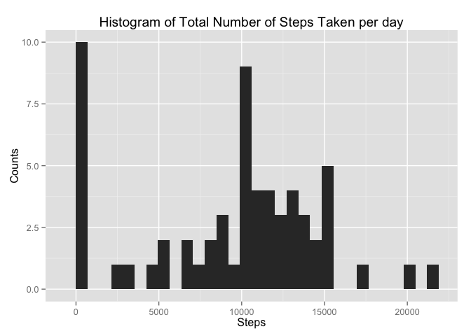
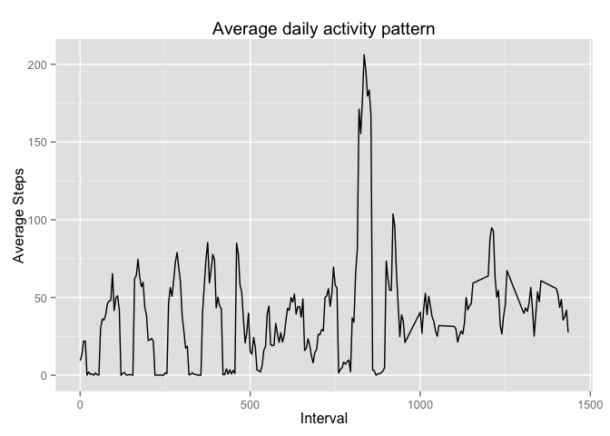
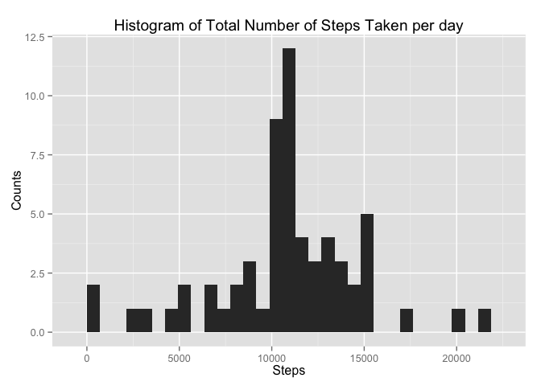
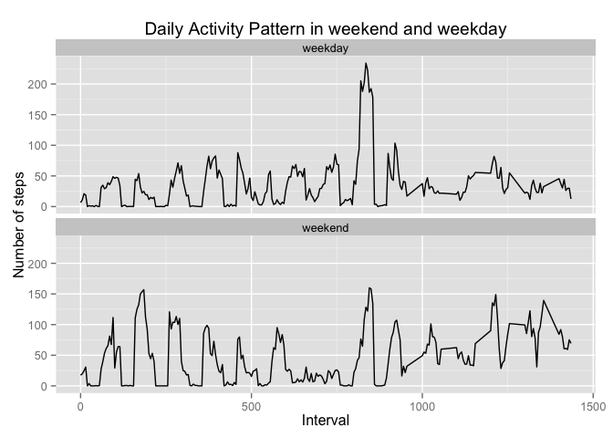

# Reproducible Research: Peer Assessment 1

We first load necessary libraries for data cleanning, plotting, and date processing. 

```r
library(dplyr)
```

```
## 
## Attaching package: 'dplyr'
## 
## The following objects are masked from 'package:stats':
## 
##     filter, lag
## 
## The following objects are masked from 'package:base':
## 
##     intersect, setdiff, setequal, union
```

```r
library(ggplot2)
library(lubridate)
unzip("activity.zip")
```

## Loading and preprocessing the data

```r
rawdata <- read.csv("activity.csv")
summary(rawdata)
```

```
##      steps                date          interval     
##  Min.   :  0.00   2012-10-01:  288   Min.   :   0.0  
##  1st Qu.:  0.00   2012-10-02:  288   1st Qu.: 588.8  
##  Median :  0.00   2012-10-03:  288   Median :1177.5  
##  Mean   : 37.38   2012-10-04:  288   Mean   :1177.5  
##  3rd Qu.: 12.00   2012-10-05:  288   3rd Qu.:1766.2  
##  Max.   :806.00   2012-10-06:  288   Max.   :2355.0  
##  NA's   :2304     (Other)   :15840
```

```r
# more preprocessing steps are done later
```


## What is mean total number of steps taken per day?
I first group the rawdata by date info, and calculate the total number of steps take per day, ignoring the missing value.

```r
mean.steps <- group_by(rawdata, date) 
steps.day = summarise(mean.steps, step.per.day = sum(steps,na.rm = TRUE) )
```

Below, we plot the hisogram of the total number of steps taken per day.

```r
ggplot(data=steps.day, aes(x=step.per.day)) + 
    geom_histogram() + 
    ggtitle("Histogram of Total Number of Steps Taken per day") + 
    xlab("Steps") + 
    ylab("Counts")
```

```
## stat_bin: binwidth defaulted to range/30. Use 'binwidth = x' to adjust this.
```

 

Below, we calculate and report the **mean** and **median** total number of steps taken per day.

```r
mean(steps.day$step.per.day)
```

```
## [1] 9354.23
```

```r
median(steps.day$step.per.day)
```

```
## [1] 10395
```

## What is the average daily activity pattern?
Group the time intervals in different days, using modular calculation.

```r
rawdata$interval.index <- (rawdata$interval) %% 1440
daily.pattern <- group_by(rawdata, interval.index) 
steps.interval = summarise(daily.pattern, step.per.interval = mean(steps,na.rm = TRUE) )
```

Make the time series plot. 


```r
ggplot(data = steps.interval, aes(interval.index, step.per.interval)) + 
    geom_line() + 
    labs(title="Average daily activity pattern", x = "Interval", y = "Average Steps")
```

 

Find the index of the 5-minute interval which contains the maximum number of steps.

```r
which.max(steps.interval$step.per.interval)
```

```
## [1] 168
```
Result show that the 168-th 5-minute interval containing the maximum number of steps.

## Imputing missing values
Calculate the total number of missing values in the dataset.

```r
sum(is.na(rawdata$steps))
```

```
## [1] 2304
```

Filling in all of the missing values, using the mean for that 5-minute interval, and create a new dataset named **newdata**.

```r
newdata <- rawdata
steps.old <- rawdata$steps
n <- length(steps.old)
for(i in 1:n) {
    if ( is.na(steps.old[i]) ) {
        test = rawdata[i,3] %% 1440 #get the interval value 
        newdata[i,1] <- filter(steps.interval, interval.index == test)$step.per.interval
    }
}
```

Make a histogram of the total number of steps taken each day and Calculate and report the mean and median total number of steps taken per day.


```r
new.mean.steps <- group_by(newdata, date) 
new.steps.day = summarise(new.mean.steps, step.per.day = sum(steps,na.rm = TRUE) )

ggplot(data=new.steps.day, aes(x=step.per.day)) + 
    geom_histogram() + 
    ggtitle("Histogram of Total Number of Steps Taken per day") + 
    xlab("Steps") + 
    ylab("Counts")
```

```
## stat_bin: binwidth defaulted to range/30. Use 'binwidth = x' to adjust this.
```

 

```r
mean(new.steps.day$step.per.day)
```

```
## [1] 10766.19
```

```r
median(new.steps.day$step.per.day)
```

```
## [1] 10766.19
```

Obviously, we can see both the mean and medium value increase. 

## Are there differences in activity patterns between weekdays and weekends?

Create a new factor variable in the dataset with two levels -- "weekday" and "weekend" indicating whether a given date is a weekday or weekend day.


```r
## differences in activity patterns between weekdays and weekends
Sys.setlocale("LC_ALL", 'en_US.UTF-8')
```

```
## [1] "en_US.UTF-8/en_US.UTF-8/en_US.UTF-8/C/en_US.UTF-8/zh_CN.UTF-8"
```

```r
tmp <- weekdays(ymd(rawdata$date))
tmp2 <- tmp
tmp2[tmp == "Sunday" | tmp == "Saturday"] <- "weekend"
tmp2[tmp != "Sunday" & tmp != "Saturday"] <- "weekday"

rawdata$week.status <- factor(tmp2)

rawdata.weekday <- filter(rawdata, week.status == "weekday" )
weekday.pattern <- group_by(rawdata.weekday, interval.index) 
weekday.steps.interval = summarise(
    weekday.pattern, step.per.interval = mean(steps,na.rm = TRUE) 
    )

rawdata.weekend <- filter(rawdata, week.status == "weekend" )
weekend.pattern <- group_by(rawdata.weekend, interval.index) 
weekend.steps.interval = summarise(
    weekend.pattern, step.per.interval = mean(steps,na.rm = TRUE) 
)

weekday.steps.interval$week.status <- factor(rep("weekday", times = dim(weekday.steps.interval)[1]))
weekend.steps.interval$week.status <- factor(rep("weekend", times = dim(weekend.steps.interval)[1]))

output <- rbind(weekday.steps.interval,weekend.steps.interval)
```

Make a panel plot containing a time series plot (i.e. type = "l") of the 5-minute interval (x-axis) and the average number of steps taken, averaged across all weekday days or weekend days (y-axis).


```r
ggplot(output, aes(interval.index, step.per.interval) ) +
    facet_wrap(~ week.status, nrow = 2, ncol = 1) +
    geom_line() +
    labs(title="Daily Activity Pattern in weekend and weekday", x = "Interval", y = "Number of steps")
```

 
